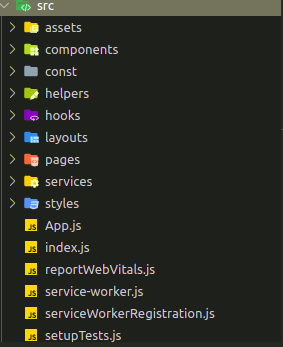
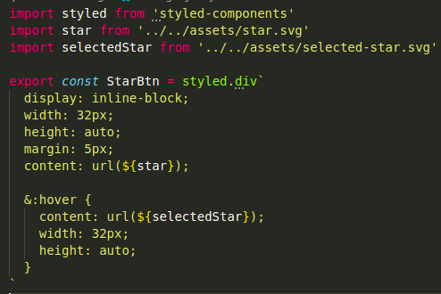

<!-- PROJECT SHIELDS -->

[![Forks][forks-shield]][forks-url]
[![Stargazers][stars-shield]][stars-url]
[![Issues-open][issues-open-shield]][issues-url]
[![Issues-closed][issues-closed-shield]][issues-url]
[![Contributors][contributors-shield]][contributors-url]

<!-- PROJECT LOGO -->

|                                            Dasher - User App                                             |
| :------------------------------------------------------------------------------------------------------: |
|                                              ![app-icon][]                                               |
|                        ONLINE ACCESS SYSTEM FOR CUSTOMER AND CONSUMER MONITORING.                        |
|                          [🐞 Report a bug or 🙋‍♂️ request a feature][issues-url]                           |
| [![contributions welcome][contributions-welcome]][issues-url] [![License][badge-apache]][apache-license] |

- [Dasher-user Docs](#dasher-user-docs)
  - [Features](#features)
  - [How to run the project:](#how-to-run-the-project)
  - [Technologies:](#technologies)
  - [Front:](#front)
  - [File Structure:](#file-structure)
  - [The styled components:](#the-styled-components)
  - [GIT USE:](#git-use)
  - [FAQ:](#faq)
  - [Collaborators](#collaborators)

# Dasher-user Docs

Do you want to know how your shipment is going and how long it will arrive? You just have to enter this app where you can review the travel of your shipment in real time, see the confirmation of departure and the confirmation of receipt.

## Features

![javascript][]
![react][]

## How to run the project:

1. Clone the repository

```
git clone https://github.com/Azordev/dasher-user.git
```

2. Go to the project folder

```
cd dasher-user
```

3. Install dependencies

```
npm install
```

or

```
yarn install
```

4. Run

```
npm start
```

or

```
yarn start
```

After executing any of the above commands, a development server will start; generally on port 3000. You must go to your browser and enter [localhost:3000](localhost:3000) and you will have access to the project.

## Technologies:

The project has been developed using various technologies. Some of them are:

## Front:

For the front, React has been used, which is a powerful framework that allows us to interact dynamically with the DOM and encapsulate tons of functionalities through components. [React Docs](https://reactjs.org/docs/getting-started.html)

**Graphql:**

GraphQL is a language that allows us to manipulate the data to generate efficient and fast APIs. [GraphQL Docs](https://graphql.org/learn/)

**EsLint:**

We like that our projects handle a clean code; that's why every time you commit & push, EsLint will analyze your input to make sure it complies with best practices.

## File Structure:

The magic of the project happens inside the src folder. It is there where you will find all the components, pages and styles.

<table border="0">
    <td width="300px">
        
    </td>
    <td>
        <b>assets:</b> In this folder we place all the graphic resources. If you need to add / use a new image, this is the site.<br/><br/>
        <b>components:</b> The components are functionalities that we can reuse in many parts of our project. For example, if we need a button; we develop it only once and then we can call it as many times as we need it. We like to separate styles from logic and structure. That is why in this folder you will find styled components that are then used in the layout file.<br/><br/>
        <b>pages:</b> Here we place the structure of each section of the project and it is where we mostly use the components<br/><br/>
        <b>services:</b> GraphQL works with queries and mutations which are basically the way data is obtained and inserted respectively. The code for the manipulation of the data must go in this folder.<br/><br/>
        <b>styles:</b> Here we get the global styles that we can use throughout the project.    
    </td>
</table>

## The styled components:

<table border="0">
    <td style="vertical-align: top">
        React allows us to develop html elements from css styles that we can then use in layouts. It is a practical way to organize our components and avoid the use of pure html and inline styles in the views.
    </td>
    <td width="50%">
        
    </td>
</table>

## GIT USE:

There are some rules that apply when interacting with the project repository. This will allow us to have a standard that any developer can understand. It is important to comply with these rules so that the linting tool allows us to use the repository.

**Branch:**

Every time an issue is assigned to you, you must create a new branch. This can be done through the command:

```
git branch <name of branch>
```

For convenience, the branches should have a defined structure. For example, if the issue is about adding a new feature, the branch should be:

```
feature/#issuenumber-brief-description-of-the-feature
```

Suppose we have issue #12 that asks us to add a header to the main page. Then, the branch would be as follows:

```
feature/#12-add-header-to-main-page
```

If it is about solving a bug, we just have to put the word "fix" in front of it. For example:

```
fix/#14-remove-bad-media-queries-in-rating-component
```

**Commits:**

Like branches, commits must also follow a format. Notice how the commit message varies if it is a feature or a bug fix.

**feat**: added header to main page

**fix**: removed bad media queries in rating component

**Pull Request (PR):**

The PR’s are requests that as developers we make once the solution of an issue is completed and we want the code to be integrated into the master branch of the project. Before that, we must ensure that our code is fully functional and adhering to best practices.

Once we have done a commit & push in our branch, a notification with a yellow background will appear in the github repository and will ask us to continue with the PR. In the TextArea to perform the PR you will find several sections that you want to complete: A brief description of what you did, a snapshot (if applicable), the tasks that were completed and the steps to view them.

## FAQ:

**How do I create a new component?**

In the component folder, create a new file with the .jsx extension. Make sure to put an appropriate name to the functionality that you are going to develop.

## Collaborators

|   [Israel Laguan][author-github]    | ![email-icon][] Email me to [contact@israellaguan.com][author-email] / ![linkedin-icon][] Connect to [my Linkedin][author-linkedin] |
| :---------------------------------: | :---------------------------------------------------------------------------------------------------------------------------------: |
|           ![author-pic][]           |                                                                                                                                     |
|    [Victor Peña][victor-github]     | ![email-icon][] Email me to [victordev2002@gmail.com][victor-email] / ![linkedin-icon][] Connect to [my Linkedin][victor-linkedin]  |
|           ![victor-pic][]           |                                                                                                                                     |
|  [Emanuel Azocar][emanuel-github]   |                                  ![email-icon][] Email me to [azocarmel@gmail.com][emanuel-email]                                   |
|          ![emanuel-pic][]           |                                                                                                                                     |
|   [Angelica Molina][ange-github]    |                                 ![email-icon][] Email me to [angeli.molina1@gmail.com][ange-email]                                  |
|            ![ange-pic][]            |                                                                                                                                     |
|   [Roman Rodriguez][roman-github]   |                                 ![email-icon][] Email me to [romanrodri192@gmail.com][roman-email]                                  |
|           ![roman-pic][]            |                                                                                                                                     |
|      [Tony Tarco][tony-github]      |                                   ![email-icon][] Email me to [tonytarco@hotmail.com][tony-email]                                   |
|            ![tony-pic][]            |                                                                                                                                     |
|  [Ildebrando Quinchoa][ild-github]  |                                 ![email-icon][] Email me to [ildebrandoefrain@gmail.com][ild-email]                                 |
|            ![ild-pic][]             |                                                                                                                                     |
|     [Denis Osuna][denis-github]     |                                   ![email-icon][] Email me to [denisosuna@gmail.com][denis-email]                                   |
|           ![denis-pic][]            |
| [Jose Hernandez][jhernandez-github] |                              ![email-icon][] Email me to [josehernandez12@gmail.com][jhernandez-email]                              |
|         ![jhernandez-pic][]         |

<!-- MARKDOWN LINKS & IMAGES -->

[contributors-shield]: https://img.shields.io/github/contributors/Azordev/dasher-user?style=for-the-badge
[contributors-url]: https://github.com/Azordev/dasher-user/graphs/contributors
[forks-shield]: https://img.shields.io/github/forks/Azordev/dasher-user?style=for-the-badge
[forks-url]: https://github.com/Azordev/dasher-user/network/members
[stars-shield]: https://img.shields.io/github/stars/Azordev/dasher-user?style=for-the-badge
[stars-url]: https://github.com/Azordev/dasher-user/stargazers
[issues-open-shield]: https://img.shields.io/github/issues/Azordev/dasher-user?style=for-the-badge
[issues-closed-shield]: https://img.shields.io/github/issues-closed/Azordev/dasher-user?style=for-the-badge
[react]: https://img.shields.io/badge/React-16+-61DAFB?style=for-the-badge&logo=react
[javascript]: https://img.shields.io/badge/JAVASCRIPT-ES6%2B-F7DF1E?style=for-the-badge&logo=javascript
[css]: https://img.shields.io/badge/style-CSS-1572B6?style=for-the-badge&logo=css3
[contributions-welcome]: https://img.shields.io/badge/contributions-welcome-brightgreen.svg?style=for-the-badge
[issues-url]: https://github.com/Azordev/dasher-user/issues
[badge-apache]: https://img.shields.io/badge/License-Apache%202.0-blue.svg?style=for-the-badge
[apache-license]: https://opensource.org/licenses/Apache-2.0
[author-pic]: https://avatars2.githubusercontent.com/u/36519478?s=460&v=4
[author-github]: https://israel-laguan.github.io
[author-linkedin]: https://www.linkedin.com/in/israellaguan
[author-email]: mailto:contact@israellaguan.com
[linkedin-icon]: https://img.icons8.com/color/20/000000/linkedin.png
[email-icon]: https://img.icons8.com/color/20/000000/message-squared.png
[app-banner]: docs/app-banner.png
[app-icon]: public/dasher.123.png
[icons8]: https://icons8.com/
[icons8-logo]: https://img.icons8.com/fluent/20/000000/icons8-new-logo.png
[api-logo]: https://spoonacular.com/images/spoonacular-logo-b.svg
[victor-github]: https://github.com/Katsu08
[victor-pic]: https://avatars.githubusercontent.com/u/66505715?v=4
[victor-email]: mailto:victordev2002@gmail.com
[victor-linkedin]: https://www.linkedin.com/in/v%C3%ADctor-pe%C3%B1a-348a3918a/
[emanuel-github]: https://github.com/e-azocar
[emanuel-pic]: https://avatars.githubusercontent.com/u/61360270?v=4
[emanuel-email]: mailto:azocarmel@gmail.com
[roman-github]: https://github.com/romanrguez192
[roman-pic]: https://avatars.githubusercontent.com/u/69876913?s=200&v=4
[roman-email]: mailto:romanrodri192@gmail.com
[tony-github]: https://github.com/Tonytarco
[tony-pic]: https://avatars.githubusercontent.com/u/37258801?s=200&v=4
[tony-email]: mailto:tonytarco@hotmail.com
[ange-github]: https://github.com/angelik0828
[ange-pic]: https://avatars.githubusercontent.com/u/4030477?s=200&v=4
[ange-email]: mailto:angeli.molina1@gmail.com
[ild-github]: https://github.com/ildebr
[ild-pic]: https://avatars.githubusercontent.com/u/73916430?v=4
[ild-email]: mailto:ildebrandoefrain@gmail.com
[denis-github]: https://github.com/denisosuna
[denis-pic]: https://avatars.githubusercontent.com/u/21060798?v=4
[denis-email]: denisosuna@gmail.com
[jhernandez-github]: https://github.com/elpollo12
[jhernandez-pic]: https://avatars.githubusercontent.com/u/7535800?v=4
[jhernandez-email]: josehernandez12@gmail.com
